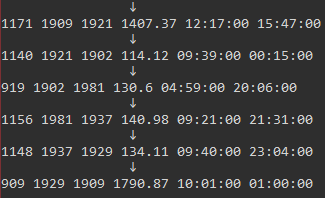

# Train_program
Implementation of algorithm for train schedule.

## Only part with the best path for cost was solved.

## How it works?
1. Read train schedule from CSV-file.
2. Build an associate array to operate simpler with cycles.
3. Fill matrix with costs from array with train schedule.
4. Copy original matrix before it will be transformed by Little's algorithm.
5. Run Little's algorithm.
6. Get optimal path for the cost.

## Little's algorithm [ReserchGate](https://www.researchgate.net/publication/307554084_On_the_Optimization_and_Parallelizing_Little_Algorithm_for_Solving_the_Traveling_Salesman_Problem)
1. We carry out the reduction of the matrix **D** row by row by subtracting from all elements of each row the minimum value in the row. Obviously, the shortest route after such an operation will remain the shortest.
2. Similarly, we carry out the reduction of the matrix **D** by columns.
3. The sum of the minimum values subtracted at the previous two stages will be called the reduction constant. It has the meaning of a lower bound for the length of the shortest route. If now it was possible to construct a Hamiltonian cycle only from edges of zero length, this would be the best option.
4. For each edge of length zero in the modified matrix D, we obtain the so-called "zero estimate" **V**ij. For an element in position (i, j), it is equal to the sum of the minimum elements in the i-th row and j-th column (not counting this zero itself).
5. Select the zero element with the maximum score, let it be the element located in the i-th row and j-th column. Now all valid routes can be divided into two classes: containing the edge (i, j) and not containing. For the latter, the lower bound for the length of the optimal route increases by **V**ij. 

## More description can be found in the code comments throughout the program.

### Result

